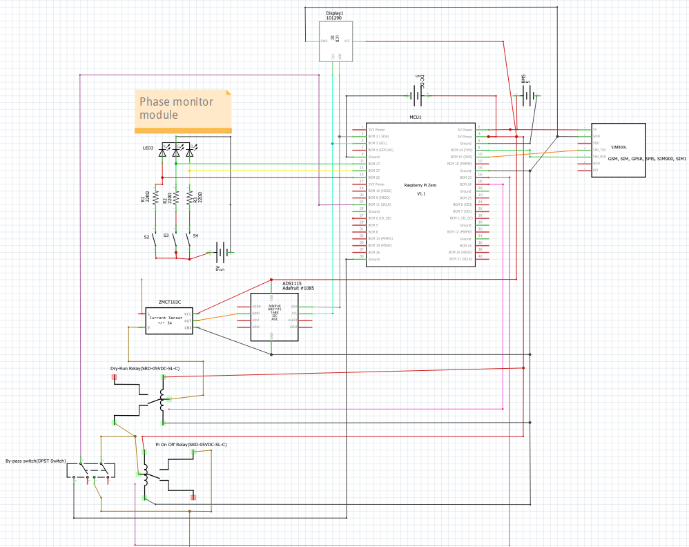

# veer_auto_farm
# Raspberry Pi-Based Auto Farm System

## Overview

This project is a **GSM/GPRS-controlled auto farm system** built using a **Raspberry Pi Zero 2 W**. The system automates motor control and monitors bypass mode, dry-run conditions, and phase availability using relays and sensors. It also includes an LCD display for real-time status updates.

## Hardware Components

- **Raspberry Pi Zero 2 W** – Main microcontroller
- **SIM800L** – GSM/GPRS module for remote control
- **ZMCT103C + ADS1115** – AC current sensor for dry-run detection
- **DPST Switch** – For detecting bypass mode
- **SRD-05VDC-SL-C Relays (2x)** – For motor on/off control and dry-run protection
- **Phase Monitoring Module** – Detects phase loss and faults
- **LCD (I2C)** – Displays system status
- **Power Setup**:
  - AC-DC Adapter (12V, 3A)
  - Li-Ion Batteries (4x DMEGC INR18650-26E)
  - BMS (2S 20A)
  - DC-DC Step Down (XL4015 - 5V, 4.2V, 12V)

## Wiring Diagram



### Key GPIO Connections:

| Component                                  | GPIO Pin                 |
| ------------------------------------------ | ------------------------ |
| **LCD (I2C)**                              | SDA (BCM 2), SCL (BCM 3) |
| **ZMCT103C + ADS1115**                     | I2C (SDA, SCL)           |
| **Bypass Mode Detection (DPST Switch)**    | GPIO 23                  |
| **Dry-Run Relay**                          | GPIO 18                  |
| **Pi On/Off Relay**                        | GPIO 16                  |
| **Phase Monitor - Green (OK)**             | GPIO 11                  |
| **Phase Monitor - Yellow (Initial Wait)**  | GPIO 13                  |
| **Phase Monitor - Red (Fault/Phase Loss)** | GPIO 15                  |

## Setup Instructions

1. Clone the repository:
   ```sh
   git clone https://github.com/veer_auto_farm.git
   cd your-repo-name
   ```
2. Install dependencies:
   ```sh
   sudo apt update && sudo apt install python3-pip
   pip3 install RPi.GPIO smbus2 adafruit-circuitpython-ads1x15
   ```
3. Connect hardware as per the Fritzing schematic.
4. Run the main script:
   ```sh
   python3 main.py
   ```

## How It Works

- **Bypass Mode Detection**: A DPST switch changes state when the motor is manually turned on, and the Raspberry Pi detects it via GPIO 23.
- **Dry-Run Detection**: ZMCT103C AC current sensor (with ADS1115) checks if the motor draws current. If no current is detected, the motor is in dry-run mode.
- **Phase Monitoring**: The phase monitor module checks for faults and missing phases, updating GPIO states accordingly.
- **Motor Control**: The system controls relays connected to GPIO 16 (Pi On/Off Relay) and GPIO 18 (Dry-Run Relay) to automate motor operations.
- **LCD Display**: Displays real-time system status.

## Project Versioning Roadmap

We are following a phased development approach. Each version has multiple phases.  

### Version 0 — Core Power + Basic Motor Control
**Goal:** Safely power the system and achieve reliable motor ON/OFF control with manual override and logging.
#### Phase 1 — Power & Safety Setup
- [ ] Assemble power module (AC/DC adapter → buck converter → Pi 5V, motor 4V/relay)  
- [ ] Add smoothing capacitors, fuses, and protection diodes  
- [ ] Wire battery + BMS for backup power  
- [ ] Connect dry-run sensor wiring (not yet automated in code)  
- [ ] Test Pi boot stability on both adapter and battery  
**Acceptance Criteria:**  
- Pi runs for ≥2 hours on battery without reboot  
- Relays don’t chatter  
- Protection circuits functional  
#### Phase 2 — Motor Control by Pi
- [ ] Connect motor relay to Pi GPIO  
- [ ] Add manual ON/OFF switch in parallel  
- [ ] Python script to toggle motor ON/OFF  
- [ ] Log ON/OFF events to CSV  
- [ ] Manually test dry-run detection  
**Acceptance Criteria:**  
- Pi toggles motor reliably  
- Manual override works  
- Logs contain correct timestamps  

### Version 1 — Scheduling & local automation
- **Deliverables:** scheduling engine on Pi (cron or scheduler), simple UI or config file for schedules, logs retained.
- **Acceptance:** scheduled operations run and are logged; manual override still works.

### Version 2 — Remote I/O (ESP32) + wiring consolidation
- **Deliverables:** ESP32 at valve/filter location acting as remote I/O (relays for valves, solenoid, digital inputs), Pi sends commands over Wi-Fi; robust connector/cable layout.
- **Acceptance:** Pi can command valve open/close via ESP32 and get status back; local wiring reduced and tidy; fail-safe on comms loss.

### Version 3 — Filter automation (convert semi-auto → automated)
- **Deliverables:** solenoid flush + motor control integrated; limit switches or pressure-switch + comparator for fail-safe; ESP32 handles execution (local controller) but Pi schedules.
- **Acceptance:** automated flush cycle triggers on pressure threshold or on schedule; manual override available; no damage to filter in repeated cycles.

### Version 4 — Fertigation (pilot)
- **Deliverables:** fertigation pump/venturi control, recipe implementation (Pi), local execution via ESP32, safety interlocks (low-flow/pressure checks).
- **Acceptance:** a controlled trial run of fertigation with logs and rollback; confirmation of dosing accuracy.

### Version 5 — Full integration & pipeline changes
- **Deliverables:** finalize wiring, mechanical upgrades, central logs + backup, analytics pipeline (export to Google Sheets initially), documentation, maintenance checklist.
- **Acceptance:** system runs an end-to-end irrigation cycle with scheduled filter cleaning, valves working, and logged data; remote alerts enabled.

### Deployment Process
1. Develop & test in **Test Environment** (test hardware + test branch in Git).  
2. Review all functionality against acceptance criteria.  
3. Merge tested code into **Production Environment** (main branch + live hardware).  
4. Tag Git commit with version number (e.g., `v1.0-phase2`).  

## Future Improvements

- **Optimize power consumption**
- **Add logging and remote monitoring**
- **Enhance GSM module communication**

---

### Contributors

- **Swapnil Sanjay Veer** – Project Lead

### License

This project is licensed under the MIT License.

