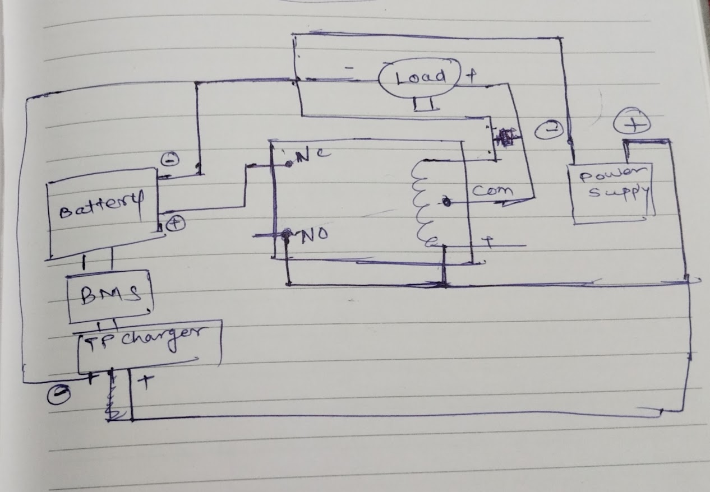

# Final Power System Components

## Overview
**Purpose:** Powers the Raspberry Pi (5V) and SIM800L (4V), with 8-10 hour battery backup, switching between 12V mains and 7.4V battery using a 12V relay.


## Component List

### Mains Adapter: 12V 2A AC-DC Adapter
- **Specs:** 230V AC to 12V DC, 2A (24W).
- **Purpose:** Primary power source, charges battery, energizes relay.
- **Source:** Amazon India (₹200-400), Flipkart, or local electrical stores.
- **Cost:** ₹200-400.

### Battery: 4x 18650 Li-ion Cells (2600mAh each, 2S2P configuration)
- **Specs:** 5.2Ah at 7.4V nominal (8.4V full, 6V discharged) = 38.48 Wh (16 hours at 2W).
- **Purpose:** Backup power for 8-10+ hours.
- **Source:** Amazon India (₹200-300 each), Robu.in, or local battery shops.
- **Cost:** ₹800-1200.
- **Note:** Use a battery holder or solder with care; ensure reputable cells (e.g., Samsung, Panasonic knockoffs).

### Battery Management System (BMS): 2S BMS (7.4V, 10A)
- **Specs:** Balances and protects 2S Li-ion pack, 10A max discharge.
- **Purpose:** Manages battery charging/discharging.
- **Source:** Amazon India (₹150-250), Robu.in, or local electronics markets.
- **Cost:** ₹150-250.

### Charger: TP5100 (2S Li-ion Charger Module, 1A)
- **Specs:** Input 5-15V (12V from adapter), output 7.4V at 1A to charge 2S battery.
- **Purpose:** Charges battery from 12V adapter.
- **Source:** Amazon India (₹100-200), Robu.in, or local shops.
- **Cost:** ₹100-200.

### Relay: 12V SPDT Relay (10A contacts)
- **Specs:** Coil voltage 12V (~40-70mA), switches 10A at 5V (NO/NC contacts).
- **Purpose:** Switches load between 12V adapter (NO) and 7.4V battery (NC).
- **Source:** Amazon India (₹50-100, search “12V SPDT relay”), Robu.in, or local vendors.
- **Cost:** ₹50-100.

### Buck Converters: 2x LM2596 (Adjustable, 3A)
- **Specs:** Input 4-40V, output adjustable (set to 5V and 4V), 3A max.
- **Purpose:**
  - LM2596 #1: 12V (adapter) or 7.4V (battery) → 5V for Pi (and LCD, relays, INA219).
  - LM2596 #2: 12V (adapter) or 7.4V (battery) → 4V for SIM800L.
- **Source:** Amazon India (₹100-150 each), Flipkart, or local electronics shops.
- **Cost:** ₹200-300 total.

### Capacitor: 1000µF (16V)
- **Specs:** Electrolytic capacitor, 16V rating.
- **Purpose:** Stabilizes SIM800L power during 2A transmission peaks.
- **Source:** Amazon India (₹20-50), local shops (common component).
- **Cost:** ₹20-50.

## Total Cost for Power System
- **Range:** ₹1520-2500 (~$18-30 USD).
- **Breakdown:**
  - Adapter: ₹200-400.
  - Battery: ₹800-1200.
  - BMS: ₹150-250.
  - Charger: ₹100-200.
  - Relay: ₹50-100.
  - Buck Converters: ₹200-300.
  - Capacitor: ₹20-50.

## Final Wiring Diagram (Locked)
```

[230V AC] → [12V 2A Adapter (+)] → [Relay NO] --+
                          |                     |
                          → [Relay Coil (+)]   |
                          |                     |
                          → [TP5100 (+)] → [2S BMS] → [Battery (7.4V)] → [Relay NC] --+
[Adapter (-)] → [TP5100 (-)]   [BMS (-)]       [Relay Coil (-)]                        |
                          |                     |                                       |
                          +---------------------+---------------------+                 |
                          |                     |                     |                 |
                          → [Load (-)] ← [Load (+)] ← [Relay COM] ←--+                 |
                                       |                                               |
                                       → [LM2596 #1 (5V)] → [RPi → LCD, Relays, INA219]
                                       → [LM2596 #2 (4V)] → [SIM800L + 1000µF]

```
## Schematic Wiring Diagram:


## Confirmation
This is the locked-down power system:
- **Power Sources:** 12V 2A adapter (mains), 7.4V 2S2P battery (backup).
- **Switching:** 12V SPDT relay.
- **Outputs:** 5V (Pi and components), 4V (SIM800L).
- **Charging:** TP5100 with 2S BMS.
- **Components:** 7 items, total ₹1520-2500.
